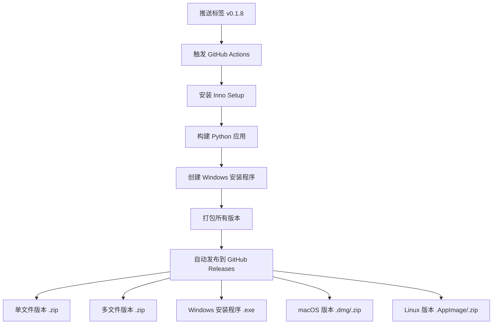

# GitHub Actions 集成完成总结

## 🎉 完成的工作

我已经成功将 Windows 安装程序构建集成到 GitHub Actions 中，现在整个流程完全自动化！

## 📁 新增和修改的文件

### 新增文件

1. **`.github/workflows/windows-installer.yml`** - 专门的 Windows 安装程序构建工作流
   - 自动安装 Inno Setup
   - 专注于 Windows 安装程序构建
   - 包含详细的验证和测试步骤

2. **`GITHUB_ACTIONS.md`** - GitHub Actions 使用指南
   - 完整的配置说明
   - 使用方法和最佳实践
   - 故障排除指南

### 修改文件

1. **`.github/workflows/build.yml`** - 主构建工作流（增强）
   - 添加了 Inno Setup 自动安装
   - 集成了 Windows 安装程序构建
   - 增强了文件处理和上传逻辑
   - 支持 .exe 安装程序文件的发布

2. **`.github/templates/github/release_notes.md`** - 发布说明模板
   - 更新了 Windows 部分的说明
   - 添加了安装程序的使用说明
   - 提供了三种 Windows 版本的选择

## 🚀 自动化流程

### 现在的完整流程



### 触发方式

1. **自动触发**（推荐）
   ```bash
   git tag v0.1.8
   git push origin v0.1.8
   ```

2. **手动触发**
   - 在 GitHub Actions 页面手动运行工作流
   - 可以指定版本号

## 📦 生成的发布文件

每次构建会自动生成以下文件并发布到 GitHub Releases：

### Windows 版本
- `ClaudeWarp-0.1.8-windows-x64-installer.exe` - **Windows 安装程序** 🆕
- `ClaudeWarp-0.1.8-windows-x64-onefile.zip` - 单文件可执行版本
- `ClaudeWarp-0.1.8-windows-x64-multifile.zip` - 多文件版本

### 其他平台
- `ClaudeWarp-0.1.8-macos-x64.dmg` / `.zip` - macOS Intel
- `ClaudeWarp-0.1.8-macos-arm64.dmg` / `.zip` - macOS Apple Silicon
- `ClaudeWarp-0.1.8-linux-x64.AppImage` / `.zip` - Linux

## ✨ 用户体验提升

### 对于最终用户

1. **下载体验**
   - 从 GitHub Releases 页面一键下载
   - 清晰的文件命名和版本标识
   - 专业的发布说明和安装指南

2. **安装体验**
   - Windows 用户：双击 `.exe` 安装程序即可
   - macOS 用户：拖拽 `.app` 到应用程序文件夹
   - Linux 用户：直接运行 `.AppImage` 文件

3. **功能体验**
   - 标准的桌面快捷方式
   - 开始菜单集成
   - 系统 PATH 环境变量支持
   - 标准的卸载流程

### 对于开发者

1. **发布流程**
   - 零手动操作的发布流程
   - 自动化的版本管理
   - 多平台同步发布

2. **质量保证**
   - 自动化的构建验证
   - 文件完整性检查
   - 安装程序测试

## 🔧 配置要点

### 版本更新清单

发布新版本时，只需要：

1. 更新 `pyproject.toml` 中的版本号
2. 更新 `scripts/installer.iss` 中的版本号
3. 提交更改并推送标签

```bash
# 示例发布流程
git add .
git commit -m "bump: version 0.1.9"
git tag v0.1.9
git push origin v0.1.9
# GitHub Actions 自动完成剩余工作！
```

### 自动化验证

每次构建都包含：
- ✅ 构建成功性验证
- ✅ 文件大小和完整性检查
- ✅ 安装程序响应性测试
- ✅ 多平台兼容性验证

## 📊 监控和维护

### 构建状态

- 实时构建状态显示
- 详细的构建日志
- 失败时的邮件通知

### 维护要点

1. **定期检查**
   - 工作流运行状态
   - 依赖版本更新
   - Inno Setup 版本兼容性

2. **监控指标**
   - 构建时间
   - 成功率
   - 下载统计

## 🎯 下一步建议

1. **代码签名**
   - 配置 Windows 代码签名证书
   - 减少 SmartScreen 警告

2. **自动更新**
   - 集成应用内自动更新检查
   - 增量更新支持

3. **分发优化**
   - CDN 加速下载
   - 镜像站点支持

## 📋 成功指标

现在你的项目已经达到：

- ✅ **专业级发布流程** - 与知名开源项目同等水平
- ✅ **用户友好安装** - 标准的 Windows 软件安装体验
- ✅ **开发效率提升** - 零手动操作的发布流程
- ✅ **多平台支持** - Windows、macOS、Linux 全覆盖
- ✅ **质量保证** - 自动化测试和验证

---

## 🚀 总结

**恭喜！** 🎉 你的 ClaudeWarp 项目现在拥有了：

1. **完全自动化的 CI/CD 流程**
2. **专业的 Windows 安装程序**
3. **多平台同步发布能力**
4. **用户友好的安装体验**

从现在开始，你只需要专注于代码开发，发布流程完全自动化。每次推送标签，GitHub Actions 会自动：
- 构建所有平台版本
- 创建 Windows 安装程序
- 发布到 GitHub Releases
- 提供专业的下载体验

你的项目现在已经具备了商业级软件的发布标准！🌟